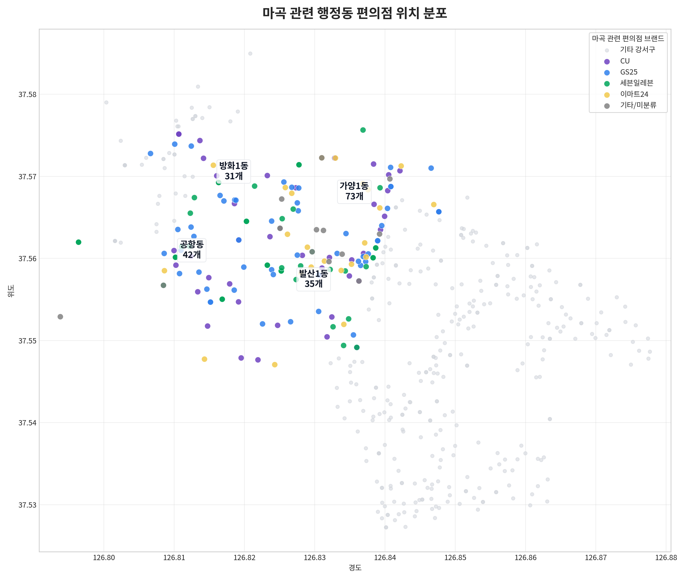
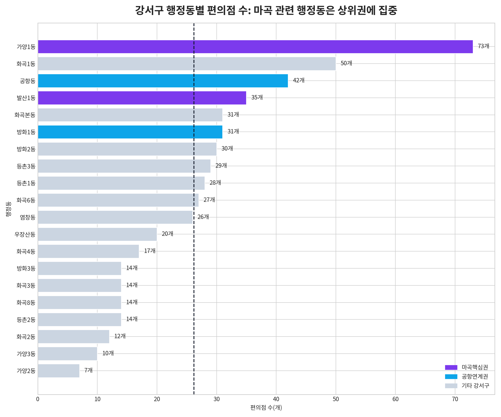
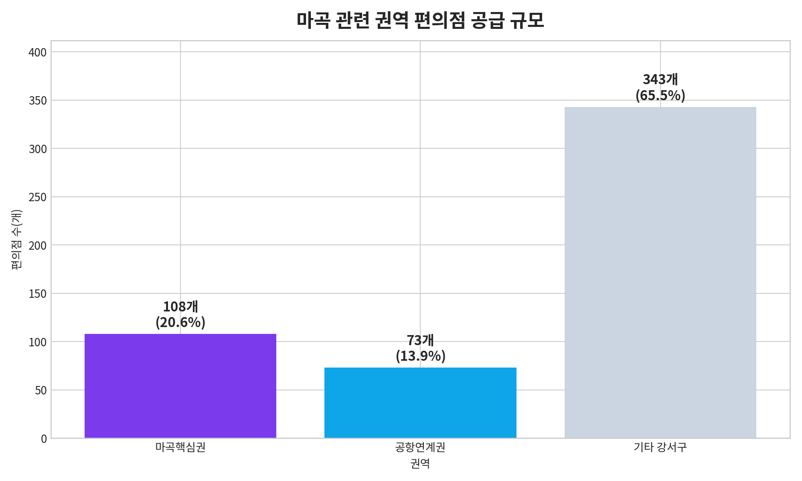

# 마곡 주변 편의점 공급 분석 메모

작성일: **2026-05-25**  
작성자: **Manus AI**

## 1. 왜 편의점 위치까지 봐야 하는가

기존 분석은 마곡의 특수성을 **수요 발생 요인** 중심으로 설명했다. 구체적으로는 강서구 1인가구 규모, 김포공항 이동 수요, 이대서울병원 의료·보호자 수요, 마곡산업단지 R&D 근무·방문 수요가 마곡 생활권에 중첩된다는 논리였다. 그러나 발표에서 입지 적합성을 설득하려면 수요만으로는 부족하다. 실제로 그 수요를 받아낼 수 있는 **생활밀착형 공급 거점**, 즉 편의점이 마곡 주변에 얼마나 있고 어디에 분포하는지도 함께 보여줘야 한다.

편의점은 1인가구, 직장인, 병원 방문객, 공항 이동객이 모두 이용할 수 있는 기본 생활 인프라다. 따라서 마곡의 복합 수요 논리를 보완하려면 **편의점 공급량과 위치 분포**를 추가하는 것이 타당하다. 이번 분석은 프로젝트 내 정제 데이터인 [`tableau_convenience_stores_gangseo.csv`](../../02_processed_data/store_and_facility/tableau_convenience_stores_gangseo.csv)를 기준으로 강서구 편의점 524개를 재집계했다.[^1]

## 2. 분석 기준

이번 분석에서 ‘마곡 주변’은 기존 마곡 특수성 분석과 맞춰 **마곡핵심권**과 **공항연계권**으로 구분했다. 마곡핵심권은 마곡 업무지구와 직접 연결되는 발산1동·가양1동이며, 공항연계권은 김포공항 접근성과 주변 생활권을 반영한 공항동·방화1동이다.

| 구분 | 포함 행정동 | 분석상 의미 |
|---|---|---|
| 마곡핵심권 | 발산1동, 가양1동 | 마곡역·발산역·마곡 업무지구와 직접 맞닿은 편의점 공급권 |
| 공항연계권 | 공항동, 방화1동 | 김포공항 이동 수요와 서부 강서 생활권을 함께 반영하는 보조 공급권 |
| 기타 강서구 | 위 4개 행정동을 제외한 강서구 | 비교 기준 권역 |

## 3. 핵심 수치

| 지표 | 값 | 발표용 해석 |
|---|---:|---|
| 강서구 전체 편의점 | 524개 | 분석 기준 전체 모수다. |
| 강서구 행정동 평균 편의점 | 26.2개 | 행정동별 편의점 수를 비교하는 기준값이다. |
| 마곡핵심권 편의점 | 108개 | 발산1동·가양1동만 합쳐도 강서구 전체의 20.61%다. |
| 공항연계권 편의점 | 73개 | 공항동·방화1동의 보조 생활권 공급 규모다. |
| 마곡 관련 4개 행정동 편의점 | 181개 | 강서구 전체 편의점의 34.54%가 마곡 관련 권역에 있다. |

마곡 관련 4개 행정동에는 총 **181개** 편의점이 위치한다. 이는 강서구 전체 편의점 524개의 **34.54%**에 해당한다. 단순히 마곡에 수요가 있다는 수준을 넘어, 실제 생활권 안에 편의점이라는 공급 거점도 상당히 밀집되어 있음을 보여준다.

| 행정동 | 권역 | 편의점 수 | 강서구 전체 대비 비중 | 강서구 행정동 평균 대비 배율 |
|---|---|---:|---:|---:|
| 발산1동 | 마곡핵심권 | 35개 | 6.68% | 1.34배 |
| 가양1동 | 마곡핵심권 | 73개 | 13.93% | 2.79배 |
| 공항동 | 공항연계권 | 42개 | 8.02% | 1.60배 |
| 방화1동 | 공항연계권 | 31개 | 5.92% | 1.18배 |

특히 **가양1동 73개**는 강서구 행정동 평균 26.2개의 **2.79배**로 매우 높다. 공항동 42개와 발산1동 35개도 각각 평균의 1.60배, 1.34배 수준이어서, 마곡 관련 권역이 강서구 안에서도 상위권 편의점 공급지를 형성하고 있음을 확인할 수 있다.

## 4. 위치 분포도 해석

위치 분포도에서는 회색 점이 기타 강서구 편의점, 컬러 점이 마곡 관련 4개 행정동 편의점이다. 마곡핵심권과 공항연계권의 편의점은 강서구 서북부와 마곡 업무지구 주변에 뚜렷하게 모여 있으며, 특히 가양1동과 발산1동 주변의 점포 밀집이 확인된다. 이는 마곡 생활권이 단순히 특정 시설 하나에 의존하는 지역이 아니라, 업무·교통·주거·상업 기능이 결합된 생활권이라는 해석을 보강한다.

행정동별 비교 차트에서도 마곡 관련 행정동의 위치가 뚜렷하다. 가양1동은 강서구 20개 행정동 중 가장 많은 편의점을 보유하고 있고, 공항동·발산1동·방화1동도 모두 강서구 행정동 평균보다 많다. 따라서 발표에서는 “마곡 주변에 수요가 있다”에서 멈추지 않고, **“그 수요를 받는 편의점 공급 거점도 이미 강서구 평균 이상으로 형성되어 있다”**고 연결하면 된다.

권역별로 보면 마곡핵심권은 108개, 공항연계권은 73개다. 두 권역을 합친 181개는 전체의 34.54%이므로, 마곡권은 강서구 전체 편의점 공급의 약 3분의 1을 차지하는 생활권으로 볼 수 있다.

## 5. 발표에서 사용할 문장

> **마곡의 특수성은 수요 요인뿐 아니라 편의점 공급 분포에서도 확인된다. 강서구 전체 편의점 524개 중 발산1동·가양1동·공항동·방화1동 등 마곡 관련 4개 행정동에 181개가 위치해 전체의 34.54%를 차지한다. 특히 가양1동은 73개로 강서구 행정동 평균의 2.79배이며, 발산1동·공항동·방화1동도 모두 평균 이상이다. 즉 마곡은 공항·병원·R&D·1인가구 수요가 중첩되는 지역일 뿐 아니라, 이를 받아낼 생활밀착형 공급 거점도 실제로 밀집한 지역이다.**

이 문장을 기존 수요 분석 뒤에 배치하면 발표 흐름이 자연스럽다. 먼저 서울 평균 대비 강서구·마곡권의 1인가구 특수성을 제시하고, 다음으로 김포공항·이대서울병원·마곡산업단지 수요를 설명한 뒤, 마지막에 편의점 위치 분포도를 보여주면 **수요와 공급이 동시에 확인되는 후보지**라는 결론을 만들 수 있다.

## 6. 해석상 주의점

편의점 수가 많다는 사실은 긍정적 근거이지만, 곧바로 “새로운 시설을 더 넣어야 한다”는 결론으로 이어지지는 않는다. 편의점 공급이 많다는 것은 후보 거점이 많다는 뜻인 동시에, 이미 공급이 밀집되어 있어 중복 경쟁 가능성도 있다는 뜻이다. 따라서 다음 단계에서는 편의점별 반경 300m 또는 500m 안의 병원, 지하철역, 업무지구 접근성, 주변 편의점 밀집도를 결합해 **공급 공백이 있는 지점**과 **프로그램 결합 가능성이 높은 지점**을 구분하는 방식으로 좁혀가야 한다.

## 7. 생성 파일

| 파일 | 설명 |
|---|---|
| [`magok_convenience_supply_summary.md`](../tables/magok_convenience_supply_summary.md) | 마곡 주변 편의점 공급 핵심 요약표 |
| [`magok_related_convenience_count_by_admin_dong.md`](../tables/magok_related_convenience_count_by_admin_dong.md) | 마곡 관련 행정동별 편의점 수와 평균 대비 배율 |
| [`magok_convenience_brand_by_admin_dong.md`](../tables/magok_convenience_brand_by_admin_dong.md) | 마곡 관련 행정동별 브랜드 분포 |
| [`magok_convenience_location_distribution.png`](../figures/magok_convenience_location_distribution.png) | 마곡 관련 편의점 위치 분포도 |
| [`magok_convenience_admin_dong_counts.png`](../figures/magok_convenience_admin_dong_counts.png) | 강서구 행정동별 편의점 수 비교 차트 |
| [`magok_convenience_zone_supply_summary.png`](../figures/magok_convenience_zone_supply_summary.png) | 마곡핵심권·공항연계권·기타 강서구 권역별 요약 차트 |

## References

[^1]: 프로젝트 정제 데이터, [`curated_project/02_processed_data/store_and_facility/tableau_convenience_stores_gangseo.csv`](../../02_processed_data/store_and_facility/tableau_convenience_stores_gangseo.csv), 소상공인 상가업소 서울 원자료에서 강서구 편의점 좌표를 추출한 분석용 파일.
