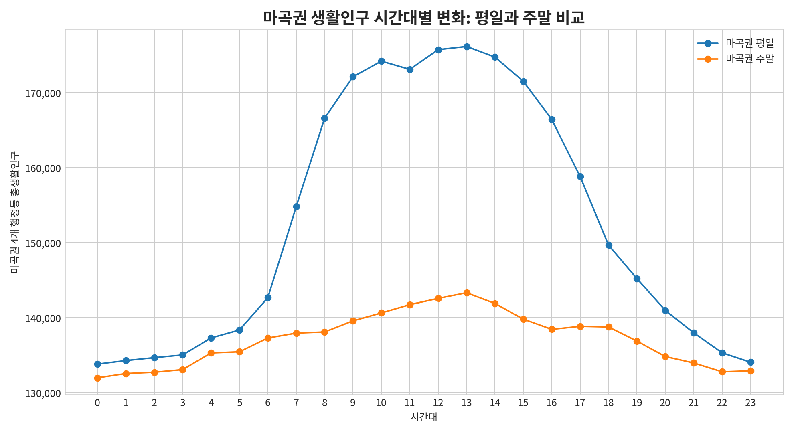
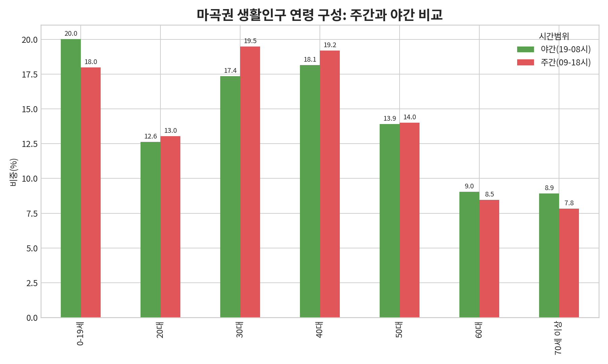
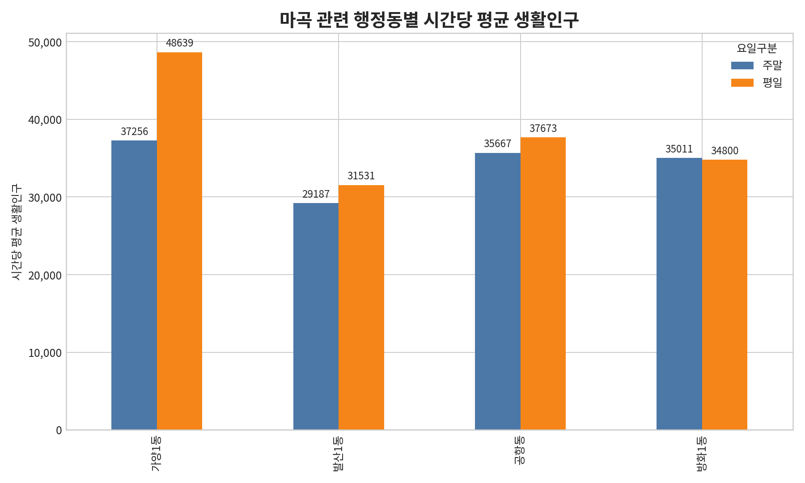
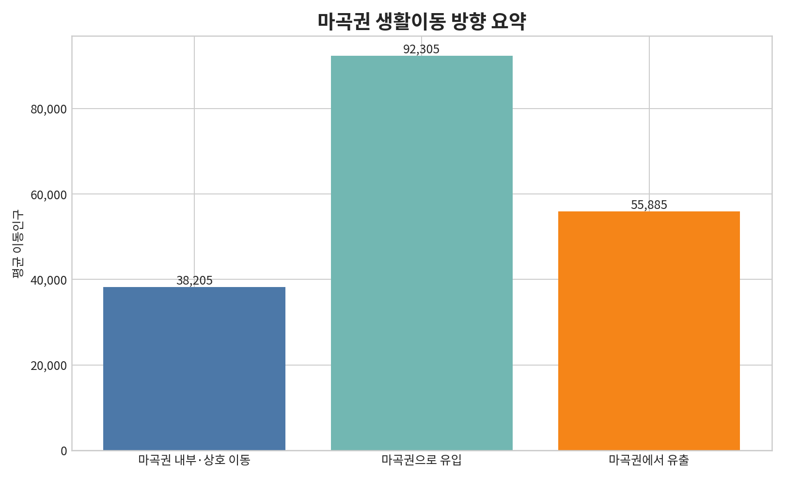

# 마곡 생활인구 분석 메모: 누가, 언제, 어디로 움직이는가

작성자: **Manus AI**  
분석 기준: 2026년 3월 행정동 단위 서울 생활인구, 마곡 관련 4개 행정동(가양1동·발산1동·공항동·방화1동)

## 1. 분석 목적과 기준

기존 분석에서는 마곡권이 서울 평균보다 **1인가구 비중과 편의점 공급이 높은 지역**이라는 점을 정적 지표로 확인했다. 이번 분석은 그 다음 단계로, 마곡권에 실제로 **어떤 사람들이 머무는지, 평일과 주말의 시간대별 체류 패턴이 어떻게 다른지, 이동 방향이 유입형인지 유출형인지**를 확인하기 위한 생활인구 분석이다. 생활인구 원자료는 서울 열린데이터광장의 `행정동 단위 서울 생활인구(내국인)` 2026년 3월 파일이며, 이 자료는 서울시 공공데이터와 통신데이터를 결합해 특정 시점·특정 지역의 존재 인구를 추정한 자료다.[^1]

> **핵심 결론은 명확하다.** 마곡권은 야간 거주 인구만 많은 지역이 아니라, 평일 7시 이후 외부 인구가 빠르게 유입되어 13시에 생활인구가 정점에 도달하는 **업무시간 집중형 생활권**이다. 동시에 주말에도 약 13만~14만 명대 생활인구가 유지되어, 업무지구와 주거·생활권 기능이 중첩된 복합 수요지로 해석된다.

## 2. 시간대별 생활인구: 평일은 업무시간 집중, 주말은 완만한 체류형

마곡권 4개 행정동의 평일 생활인구는 0시 133,790명에서 시작해 7시 154,815명, 8시 166,597명으로 급증한다. 이후 9시부터 14시까지는 약 17.2만~17.6만 명 수준을 유지하며, 13시에 176,178명으로 정점에 도달한다. 반면 주말은 0시 131,952명에서 13시 143,309명으로 완만하게 증가해, 평일처럼 출근 시간대의 급격한 상승은 나타나지 않는다.

| 구분 | 정점 시간 | 정점 생활인구 | 최저 시간 | 최저 생활인구 | 주간 09~18시 평균 | 야간 19~08시 평균 | 주간/야간 배율 |
|:---|---:|---:|---:|---:|---:|---:|:---|
| 평일 | 13시 | 176,178명 | 0시 | 133,790명 | 169,258명 | 140,775명 | 1.20배 |
| 주말 | 13시 | 143,309명 | 0시 | 131,952명 | 140,545명 | 134,676명 | 1.04배 |

서울 전체 행정동 평균과 비교해도 마곡권의 집중도는 높다. 평일 9~14시 마곡권 행정동당 생활인구는 서울 행정동 평균의 약 1.72~1.73배이며, 주말에도 전 시간대가 약 1.40~1.49배 수준을 유지한다. 따라서 발표에서는 **마곡은 평일 업무시간대에 서울 평균보다 훨씬 강하게 사람이 몰리고, 주말에도 기본 체류 수요가 유지되는 지역**이라고 설명하는 것이 적합하다.

| 대표 시간대 | 요일 | 마곡권 4개동 총생활인구 | 마곡권 행정동당 생활인구 | 서울 행정동당 생활인구 | 마곡권/서울 평균 배율 |
|:---|:---|---:|---:|---:|:---|
| 0시 | 평일 | 133,790명 | 33,448명 | 23,594명 | 1.42배 |
| 8시 | 평일 | 166,597명 | 41,649명 | 24,666명 | 1.69배 |
| 13시 | 평일 | 176,178명 | 44,044명 | 25,425명 | 1.73배 |
| 18시 | 평일 | 149,666명 | 37,417명 | 24,867명 | 1.50배 |
| 13시 | 주말 | 143,309명 | 35,827명 | 24,120명 | 1.49배 |

## 3. 어떤 사람들이 머무는가: 주간에는 30~40대 경제활동층, 야간에는 생활권 인구가 강화

연령 구성은 마곡권의 수요 성격을 설명하는 데 중요하다. 주간 09~18시 기준으로 30대가 19.5%, 40대가 19.2%로 가장 높고, 0~19세도 18.0%를 차지한다. 야간 19~08시에는 0~19세가 20.0%로 가장 높고, 40대 18.1%, 30대 17.4% 순으로 나타난다.

| 시간범위 | 0~19세 | 20대 | 30대 | 40대 | 50대 | 60대 | 70세 이상 | 해석 |
|:---|---:|---:|---:|---:|---:|---:|---:|:---|
| 주간 09~18시 | 18.0% | 13.0% | 19.5% | 19.2% | 14.0% | 8.5% | 7.8% | 30~40대 경제활동층 중심 |
| 야간 19~08시 | 20.0% | 12.6% | 17.4% | 18.1% | 13.9% | 9.0% | 8.9% | 가족·주거 생활권 성격 강화 |
| 전체 | 19.1% | 12.8% | 18.3% | 18.6% | 14.0% | 8.8% | 8.4% | 업무·주거 복합형 구성 |

이 결과는 마곡의 수요를 단순히 “젊은 1인가구가 많다”로만 설명하면 부족하다는 점을 보여준다. 발표에서는 **30~40대 직장인·경제활동층이 평일 낮 수요를 만들고, 야간과 주말에는 가족·주거 생활권 인구가 일정하게 받쳐 주는 구조**라고 정리하는 것이 더 정확하다. 성별 구성은 전체 기준 남성 48.6%, 여성 51.4%로 큰 편차는 없으며, 야간에는 여성 비중이 51.9%로 소폭 높다.

## 4. 행정동별 차이: 가양1동은 평일 집중형, 방화1동은 생활권 유지형

마곡 관련 4개 행정동을 나누어 보면 내부 차이도 뚜렷하다. 평일 기준 시간당 평균 생활인구는 가양1동 48,639명, 공항동 37,673명, 방화1동 34,800명, 발산1동 31,531명 순이다. 가양1동은 주말 37,256명에서 평일 48,639명으로 크게 증가해 업무·상업 수요가 강하고, 방화1동은 주말 35,011명과 평일 34,800명이 거의 비슷해 생활권 성격이 상대적으로 강하다.

| 행정동 | 주말 시간당 평균 생활인구 | 평일 시간당 평균 생활인구 | 평일-주말 차이 | 해석 |
|:---|---:|---:|---:|:---|
| 가양1동 | 37,256명 | 48,639명 | +11,383명 | 평일 업무·상업 집중형 |
| 발산1동 | 29,187명 | 31,531명 | +2,344명 | 생활권과 업무 수요 혼합 |
| 공항동 | 35,667명 | 37,673명 | +2,006명 | 공항·교통 결절 기능 반영 |
| 방화1동 | 35,011명 | 34,800명 | -211명 | 주거·생활권 유지형 |

## 5. 어디로 출근하고 이동하는가: 마곡권은 순유입형 생활권

생활이동 방향 분석은 서울 생활이동 자료의 기존 후보 행정동 평균 유입·유출 요약자료를 활용했다. 서울 생활이동은 서울 안에서 이동하거나 서울 외부에서 서울로 오고 가는 통근·통학·쇼핑·여가 등 행정수요 유발 이동을 의미하며, 통계적 방법으로 추정되는 자료라는 점에 유의해야 한다.[^2]

마곡권 방향별 평균 이동인구는 유입 92,305명, 유출 55,885명, 내부·상호 이동 38,205명이다. 전체 방향별 이동 중 마곡권으로의 유입이 49.5%로 가장 높고, 유출은 30.0%, 내부·상호 이동은 20.5%다. 이는 마곡권이 단순 주거 배후지가 아니라 **외부에서 들어오는 출근·방문 수요가 더 큰 순유입형 거점**임을 의미한다.

| 방향 | 평균 이동인구 | 비중 | 해석 |
|:---|---:|---:|:---|
| 마곡권으로 유입 | 92,305명 | 49.5% | 외부에서 마곡으로 들어오는 출근·방문 수요가 가장 큼 |
| 마곡권에서 유출 | 55,885명 | 30.0% | 마곡 거주·체류 인구의 외부 이동도 존재 |
| 마곡권 내부·상호 이동 | 38,205명 | 20.5% | 내부 생활권 이동 수요도 일정 규모 존재 |

동별로 보면 가양1동은 유입 32,190명, 유출 18,221명으로 순유입 13,968명이 발생해 4개 동 중 순유입 규모가 가장 크다. 발산1동은 순유입 9,344명, 방화1동은 7,057명, 공항동은 6,051명으로 모두 순유입을 보인다. 즉 마곡권 내부에서 특히 **가양1동이 외부 통근·방문 수요의 핵심 수용지**로 해석된다.

## 6. 발표에서 쓸 수 있는 한 문장 요약

마곡 생활인구 분석은 기존 1인가구·편의점 공급 분석을 보완하는 **동적 수요 근거**다. 발표에서는 다음과 같이 정리하면 논리 흐름이 자연스럽다.

| 발표 질문 | 답변 수치 | 발표 문장 |
|:---|:---|:---|
| 마곡 인구는 언제 많아지는가? | 평일 13시 176,178명, 주간/야간 1.20배 | 마곡은 평일 업무시간에 생활인구가 뚜렷하게 증가하는 업무시간 집중형 생활권이다. |
| 주말에도 수요가 유지되는가? | 주말 13시 143,309명, 주간/야간 1.04배 | 주말에는 급격한 출근형 증가는 없지만 13만~14만 명대 체류가 유지된다. |
| 어떤 사람들이 주로 머무는가? | 주간 30대 19.5%, 40대 19.2% | 주간 수요는 30~40대 경제활동층 중심이며, 야간에는 가족·주거 생활권 성격이 강화된다. |
| 어디로 출근·이동하는가? | 유입 92,305명, 유출 55,885명 | 마곡권은 외부에서 들어오는 통근·방문 수요가 더 큰 순유입형 거점이다. |
| 내부 어디가 핵심인가? | 가양1동 평일 48,639명, 순유입 13,968명 | 가양1동은 평일 생활인구와 순유입이 가장 큰 핵심 수요지다. |

## 7. 분석상 유의사항

생활인구는 2026년 3월 행정동 단위 원자료를 직접 사용했으므로 시간대별·평일/주말·성연령 구조 분석에는 재현성이 있다. 다만 생활이동 방향 분석은 행정동 단위 월별 원자료가 약 1GB 규모로 매우 커서, 이번 발표용 산출물에서는 기존 프로젝트에 저장된 후보 행정동 평균 유입·유출 요약자료를 우선 활용했다. 따라서 발표에서는 **생활인구 시간대·성연령 분석은 원자료 기반, 이동 방향은 기존 생활이동 요약자료 기반**이라고 구분해 설명하는 것이 안전하다.

## References

[^1]: [서울 열린데이터광장, 행정동 단위 서울 생활인구(내국인)](https://data.seoul.go.kr/dataList/OA-14991/S/1/datasetView.do)
[^2]: [서울 열린데이터광장, 서울 생활이동](https://data.seoul.go.kr/dataVisual/seoul/seoulLivingMigration.do)
