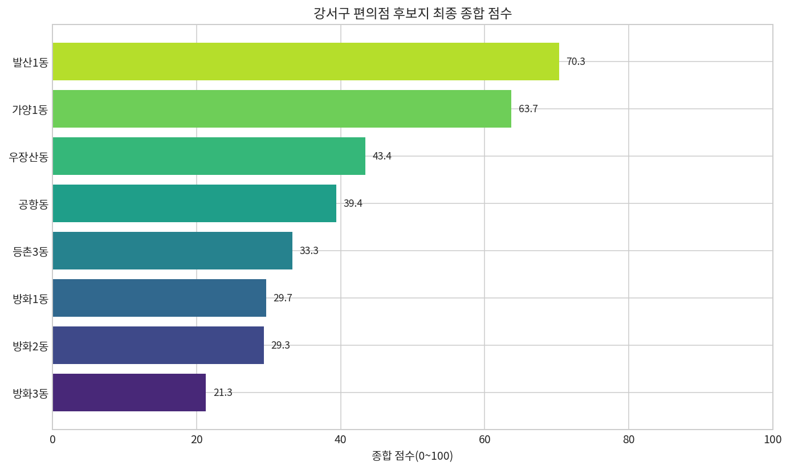
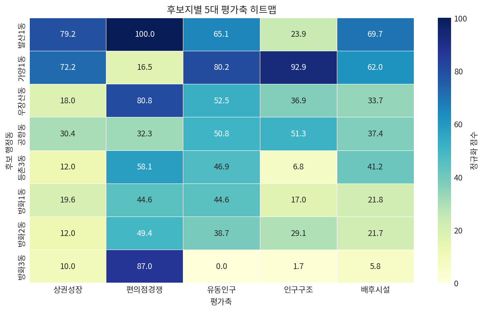
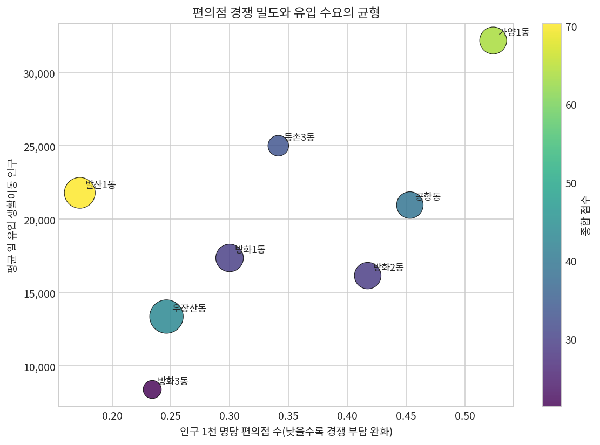
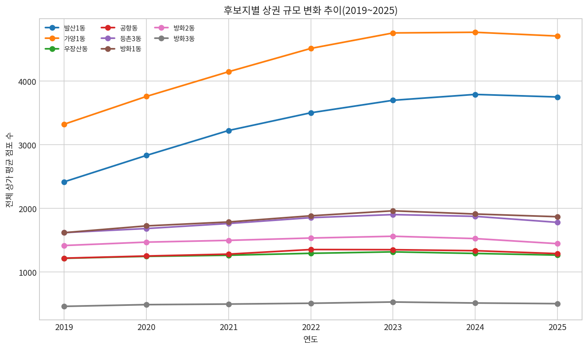
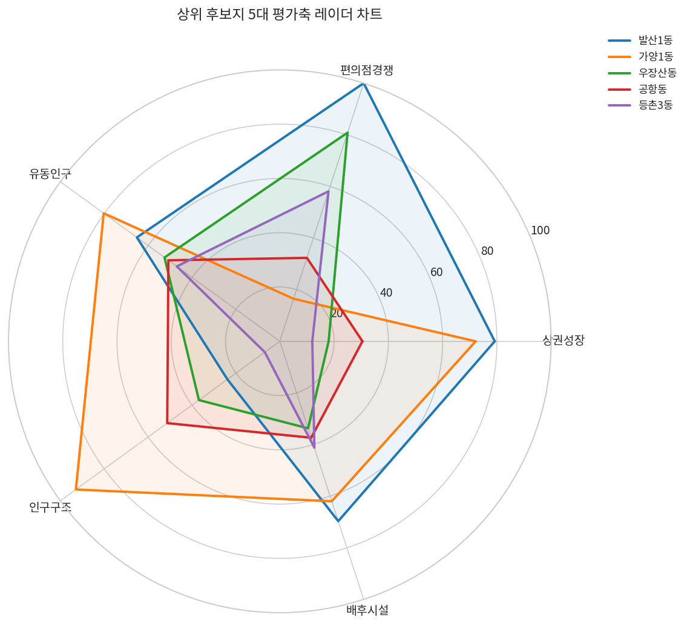

# 강서구 편의점 최적 입지 선정 최종 분석 보고서 및 PPT 스토리라인

**작성자: Manus AI**  
**작성일: 2026-05-22**

## 1. 분석 목적과 결론

본 분석의 목적은 강서구 내 편의점 신규 출점 후보지를 객관적으로 비교하여, 최종 PPT에서 제시할 수 있는 **추천 입지와 근거**를 도출하는 것이다. 기존 상권·인구·생활이동 분석에 더해 병의원 접근성, 지하철 승하차 수요, 마곡 업무지구 입주기업, 김포공항 여객 프록시, 강서구 사업체·종사자 규모를 추가 반영했다.[1] [2] [3] [4] [5] [6]

> **최종 추천 입지는 발산1동이다.** 발산1동은 상권 성장성, 낮은 편의점 경쟁 부담, 의료·업무 배후수요의 균형성이 모두 높아 신규 편의점 출점의 기대효과와 리스크 관리 측면에서 가장 안정적인 후보지로 판단된다.

| 순위 | 후보지 | 종합 점수 | 핵심 판단 |
|---:|---|---:|---|
| 1 | **발산1동** | **70.3** | 성장성, 낮은 경쟁 부담, 배후시설 균형성이 가장 우수하다. |
| 2 | 가양1동 | 63.7 | 유입 수요와 사업체 배후가 강하지만 편의점 경쟁 밀도가 높다. |
| 3 | 우장산동 | 43.4 | 지하철 수요와 경쟁 부담 완화는 좋으나 상권 성장성이 낮다. |
| 4 | 공항동 | 39.4 | 김포공항 배후수요는 강하지만 상권·경쟁 지표가 제한적이다. |
| 5 | 등촌3동 | 33.3 | 의료 접근성은 좋으나 성장성과 인구구조가 약하다. |
| 6 | 방화1동 | 29.7 | 공항권 수요는 있으나 종합 경쟁력이 중하위권이다. |
| 7 | 방화2동 | 29.3 | 공항 배후수요에도 불구하고 상권 성장성이 낮다. |
| 8 | 방화3동 | 21.3 | 경쟁 부담은 낮지만 유동인구와 배후시설이 약하다. |

## 2. 평가체계

최종 점수는 후보지별 지표를 0~100점으로 정규화한 뒤, 다섯 개 평가축으로 묶어 산출했다. 평가축은 편의점 입지에서 중요한 **상권 성장성, 경쟁 부담, 유동인구, 인구구조, 배후시설**을 균형적으로 반영하도록 설계했다.

| 평가축 | 기본 가중치 | 주요 원천 지표 | 점수 해석 |
|---|---:|---|---|
| 상권성장 | 25% | 전체 점포 변화율, 인구 변화율 | 높을수록 성장성이 크다. |
| 편의점경쟁 | 20% | 인구 1천 명당 편의점 수, 편의점 증가율 | 낮은 경쟁 밀도와 낮은 증가율을 높게 평가한다. |
| 유동인구 | 20% | 생활이동 유입, 지하철 월 승하차 수요 | 높을수록 잠재 구매 접점이 많다. |
| 인구구조 | 15% | 20~39세 비중, 60세 이상 비중, 인구 변화율 | 젊은 소비층과 인구 안정성을 높게 평가한다. |
| 배후시설 | 20% | 병의원 접근성, 응급실 접근성, 사업체 종사자, 마곡·공항 배후수요 | 업무·의료·교통 배후수요가 클수록 높다. |

## 3. 후보지별 핵심 분석

발산1동은 최종 점수 70.3점으로 1위를 기록했다. 특히 **편의점경쟁 점수 100.0점**으로 경쟁 부담 측면에서 가장 우수했으며, 상권성장 79.2점과 배후시설 69.7점도 높았다. 이는 단순히 유동인구가 많은 지역보다, 이미 과밀한 지역을 피하면서 성장성과 배후수요를 동시에 확보할 수 있는 후보지라는 점에서 의미가 있다.

가양1동은 63.7점으로 2위를 기록했다. 생활이동 유입과 사업체 종사자 규모가 크고 인구구조 점수가 92.9점으로 매우 높아 소비 잠재력은 뛰어나다. 그러나 인구 1천 명당 편의점 수가 상대적으로 높아 **편의점경쟁 점수 16.5점**에 그쳤고, 이 점이 최종 순위에서 발산1동보다 낮게 평가된 핵심 원인이다.

| 구분 | 발산1동 | 가양1동 | 해석 |
|---|---:|---:|---|
| 종합 점수 | **70.3** | 63.7 | 발산1동이 기본·대안 가중치 모두에서 1순위이다. |
| 상권성장 | **79.2** | 72.2 | 두 지역 모두 성장성이 높지만 발산1동이 더 우세하다. |
| 편의점경쟁 | **100.0** | 16.5 | 발산1동은 경쟁 밀도 리스크가 현저히 낮다. |
| 유동인구 | 65.1 | **80.2** | 가양1동은 유입 수요가 더 강하다. |
| 인구구조 | 23.9 | **92.9** | 가양1동은 젊은 소비층 측면에서 강하다. |
| 배후시설 | **69.7** | 62.0 | 발산1동은 의료·마곡권 배후수요가 균형적이다. |

## 4. 성장성 근거

2019~2025년 상권 규모 추이를 보면 가양1동과 발산1동이 다른 후보지보다 큰 상권 규모를 유지한다. 특히 발산1동은 2019년 이후 상권 규모가 꾸준히 상승했고, 2025년에도 높은 수준을 유지했다.[1]

상권 성장성만 보면 가양1동도 강력한 후보지이나, 편의점은 동일 업종 과밀의 영향을 크게 받는다. 따라서 최종 추천에서는 성장성뿐 아니라 경쟁 부담을 함께 고려해야 하며, 이 관점에서 발산1동의 우위가 명확해진다.

## 5. 민감도 분석

가중치가 달라져도 결론이 유지되는지 확인하기 위해 성장·유동수요 중시, 경쟁 리스크 중시, 배후시설 중시 시나리오를 추가로 분석했다. 모든 시나리오에서 발산1동과 가양1동은 각각 1위와 2위를 유지했다. 이는 최종 결론이 특정 가중치에 과도하게 의존하지 않는다는 의미이다.

| 후보지 | 기본 균형 | 성장·유동 중시 | 경쟁 리스크 중시 | 배후시설 중시 |
|---|---:|---:|---:|---:|
| 발산1동 | **1위** | **1위** | **1위** | **1위** |
| 가양1동 | 2위 | 2위 | 2위 | 2위 |
| 우장산동 | 3위 | 3위 | 3위 | 3위 |
| 공항동 | 4위 | 4위 | 4위 | 4위 |
| 등촌3동 | 5위 | 5위 | 5위 | 5위 |
| 방화1동 | 6위 | 6위 | 7위 | 6위 |
| 방화2동 | 7위 | 7위 | 6위 | 7위 |
| 방화3동 | 8위 | 8위 | 8위 | 8위 |

## 6. PPT 구성안

## Cover

강서구 편의점 최적 입지 선정  
상권·인구·유동·배후시설 기반 다중지표 분석

## Slide 1

**분석 질문: 어디에 열어야 성공 가능성이 높은가**

편의점 입지는 단순히 유동인구가 많은 곳보다 **상권 성장성, 경쟁 밀도, 배후수요**가 동시에 맞아야 한다. 본 분석은 강서구 후보 행정동을 비교하여 최종 추천 입지를 선정하는 것을 목표로 한다.

## Slide 2

**평가체계: 5개 축으로 입지 매력도를 점수화**

상권성장, 편의점경쟁, 유동인구, 인구구조, 배후시설을 각각 0~100점으로 표준화했다. 기본 가중치는 성장성 25%, 경쟁 20%, 유동 20%, 인구 15%, 배후시설 20%로 설정했다.

## Slide 3

**최종 1순위는 발산1동**

발산1동은 종합 점수 70.3점으로 1위를 기록했다. 가양1동은 63.7점으로 2위이며, 두 후보가 다른 지역보다 뚜렷하게 높은 점수를 보였다.

## Slide 4

**발산1동의 핵심 강점은 낮은 경쟁 부담**

발산1동은 편의점경쟁 점수 100.0점으로 후보지 중 가장 우수하다. 상권성장 점수도 79.2점으로 높아, 성장하는 상권이면서 동일 업종 과밀 리스크가 낮은 후보지이다.

## Slide 5

**가양1동은 수요는 강하지만 경쟁이 부담**

가양1동은 유동인구와 인구구조가 매우 우수하다. 그러나 편의점 경쟁 밀도가 높아 신규 출점 시 매출 분산 위험이 상대적으로 크다.

## Slide 6

**상권 규모 추이는 상위 후보의 성장성을 뒷받침**

2019~2025년 추이에서 발산1동과 가양1동은 상권 규모가 큰 후보지로 확인된다. 발산1동은 성장성과 안정성이 함께 나타난다.

## Slide 7

**민감도 분석에서도 결론은 유지**

성장·유동수요 중시, 경쟁 리스크 중시, 배후시설 중시 시나리오 모두에서 발산1동은 1위를 유지했다. 이는 추천 결론의 안정성을 보여준다.

## Slide 8

**최종 제안: 발산1동 우선, 가양1동 대안 검토**

최종 추천은 발산1동이다. 다만 가양1동은 유동인구와 업무 배후수요가 크므로, 실제 점포 단위 후보지가 확보될 경우 임대료와 경쟁점 위치를 추가 검토하는 대안 후보로 제시할 수 있다.

## 7. 산출물 안내

| 파일 | 내용 |
|---|---|
| `candidate_final_ranking.csv` | 최종 후보지 순위와 핵심 지표 |
| `candidate_score_components.csv` | 5대 평가축 점수 |
| `candidate_expanded_indicators.csv` | 병원, 지하철, 마곡, 공항, 사업체 확장 지표 |
| `sensitivity_analysis.csv` | 가중치 시나리오별 점수와 순위 |
| `expanded_multi_indicator_analysis_tables.xlsx` | 분석 표 전체를 정리한 엑셀 파일 |
| `figures/*.png` | PPT 삽입용 시각화 이미지 |
| `ppt_ready_summary_tables.md` | PPT에 바로 옮길 수 있는 요약 표 |

## 8. 분석 한계와 후속 보완

본 분석은 행정동 단위의 거시 입지 비교를 목적으로 한다. 실제 출점 의사결정에서는 동일 행정동 안에서도 역 출입구, 버스 정류장, 횡단보도, 학교·병원 입구, 임대료, 권리금, 전면부 가시성, 24시간 영업 가능 여부에 따라 결과가 달라질 수 있다. 따라서 PPT에서는 본 분석을 **1차 입지 필터링 결과**로 제시하고, 최종 점포 선정은 후보 건물 단위의 미시 입지 조사로 이어지는 구조가 적합하다.

마곡은 원자료에서 별도 행정동으로 존재하지 않기 때문에, 본 분석에서는 마곡 업무지구의 배후수요를 가양1동과 발산1동 중심의 권역 가중치로 반영했다. 이 점은 발표에서 한 문장으로 설명하면 데이터 구조에 대한 신뢰도를 높일 수 있다.

## References

[1]: ./candidate_store_industry_by_year.csv "후보지별 상가업소 업종·연도별 집계 데이터"
[2]: ./candidate_preliminary_ranking_summary.csv "기존 후보지 예비 순위 및 핵심 지표"
[3]: ./candidate_expanded_indicators.csv "후보지별 확장 지표 산출 결과"
[4]: ./magok_tenant_company_reference.csv "마곡 입주기업 참고 자료"
[5]: ./airport_statistics_reference_summary.csv "김포공항 여객 통계 참고 요약"
[6]: ./business_industry_reference_major_rows.csv "강서구 사업체·종사자 산업별 참고 행"
